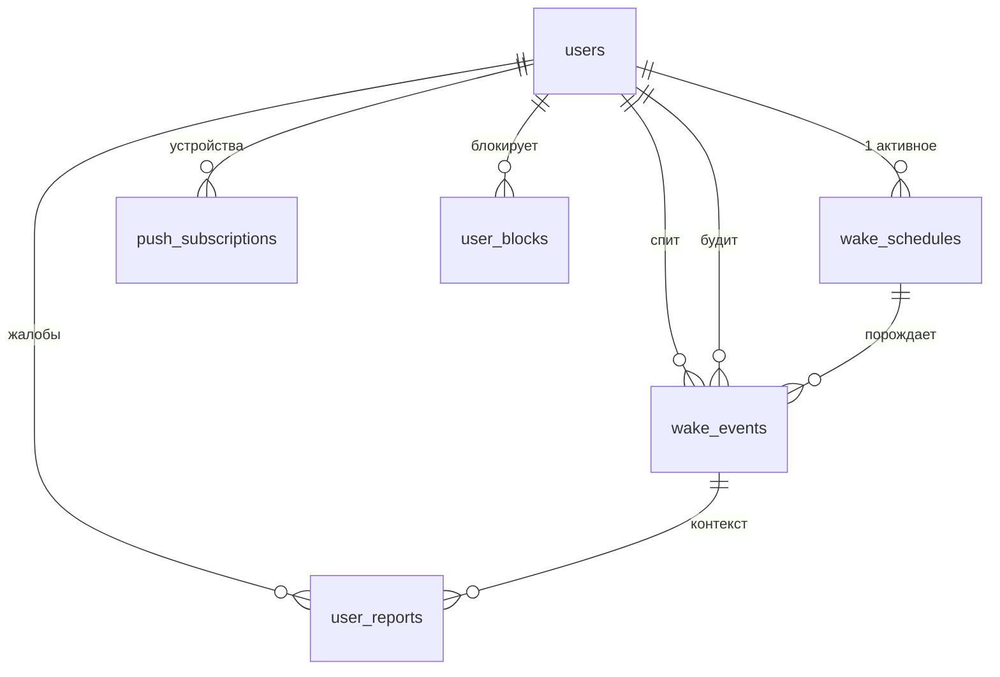

# WakeChain — структура проекта и схема БД

**Статус:** предложение, ждёт подтверждения. Код не пишется до утверждения.
**Ветка:** `claude/wakechain-app-9n44v9`

---

## 0. Несущий механизм

> **Обязательство перед конкретным живым человеком.** Не будильник. Не интерфейс.
> Тебя ждёт названный по имени человек, и подвести его дороже, чем нажать «отложить».

Всё, что ослабляет это, — вне scope. Таблица анти-scope:

| Исключено | Почему ломает механизм |
|---|---|
| ИИ-голос вместо человека | Некого подводить — остаётся плохой будильник |
| Лайки, рейтинги симпатий, знакомства | Долг превращается в рынок обаяния; оптимизируют внешность, не надёжность |
| Чаты и переписка | Поверхность для харассмента + повод болтать вместо подъёма |
| Подписка, реклама | Появляется стимул максимизировать сессии, а не пробуждения |
| Реальная телефония (PSTN) | Утечка номеров между незнакомцами — необратимо |

---

## 1. Где живёт код

**Предложение: `wakechain/` — самодостаточное приложение в этом же репозитории.**

Корень репозитория занят AMUR.BG (Next.js 16 + Supabase). Корневой CI гоняет `tsc`/`vitest`/`next build` по корню. WakeChain — другой продукт, другой деплой, другая БД. Отдельная папка со своим `package.json` не трогает работающий AMUR.BG ни на строчку.

Альтернатива — перевести репозиторий в npm workspaces (`apps/amur/`, `apps/wakechain/`). Чище на длинной дистанции, но это большой рискованный диф по живому продукту. Не сейчас.

CI: второй job в `.github/workflows/ci.yml` с `working-directory: wakechain` и `paths: ['wakechain/**']`.

---

## 2. Стек

| Слой | Выбор | Почему |
|---|---|---|
| Фронт | Next.js 16 App Router + React 19 + Tailwind v4 | Совпадает с репозиторием, mobile-first, RSC |
| Бэк | Route Handlers (Node) | Один язык, один деплой |
| БД | PostgreSQL через Supabase | Realtime + pg_cron + RLS из коробки |
| Аутентификация | Supabase Auth magic link + SMTP Resend | Токены, TTL, одноразовость — уже решённые задачи |
| Сигналинг | Supabase Realtime Broadcast (WebSocket) | Это и есть WebSocket; не нужен отдельный сервер, работает на Vercel |
| Медиа | WebRTC P2P, audio-only + TURN | P2P как в ТЗ; TURN обязателен (см. §7) |
| Пуш | Web Push (VAPID) + service worker | Как в ТЗ |
| Планировщик | Supabase `pg_cron` → тик раз в минуту | Переживает деплои, минутная гранулярность на любом тарифе |

Tailwind v4 — конфиг в CSS (`@theme inline` в `globals.css`), **никакого `tailwind.config.ts`**.

---

## 3. Структура файлов

```
wakechain/
├── package.json                    # своё, независимо от корневого
├── next.config.ts  tsconfig.json  postcss.config.mjs
├── vitest.config.ts  playwright.config.ts
├── .env.example
│
├── app/
│   ├── layout.tsx  globals.css  manifest.ts
│   ├── page.tsx                          # ЭКРАН 1 — вход (email → magic link)
│   ├── auth/
│   │   ├── verify/page.tsx               # кнопка подтверждения (защита от префетча почтовиков)
│   │   └── callback/route.ts             # обмен кода на сессию
│   ├── onboarding/page.tsx               # ЭКРАН 2 — имя, город, время, дни
│   ├── home/page.tsx                     # ЭКРАН 3 — ближайший подъём, кто будит, кого будишь
│   ├── call/[eventId]/page.tsx           # ЭКРАН 4 — входящий / исходящий звонок
│   ├── awake/[eventId]/page.tsx          # ЭКРАН 5 — «Я встал» + передача эстафеты
│   ├── profile/page.tsx                  # ЭКРАН 6 — статистика надёжности
│   │
│   └── api/
│       ├── auth/{request,consume,logout}/route.ts
│       ├── schedule/route.ts             # GET/POST/PATCH расписания
│       ├── events/[id]/
│       │   ├── call/route.ts             # будильщик начал звонок
│       │   ├── confirm/route.ts          # «Я встал»
│       │   └── refuse/route.ts           # отказ от обязательства
│       ├── push/{subscribe,sync,unsubscribe}/route.ts
│       ├── turn/route.ts                 # эфемерные TURN-креды (HMAC, TTL 1ч)
│       ├── safety/{report,block}/route.ts
│       └── cron/tick/route.ts            # ЯДРО: материализация + матчинг + эскалация
│
├── components/
│   ├── ui/          Button Card Sheet TimePicker DayPicker Stat
│   ├── call/        IncomingCall CallScreen MicPermissionGate AudioSink
│   ├── schedule/    WakeTimeForm DaysOfWeekPicker NextWakeCard
│   ├── chain/       ChainCard HandoffScreen RefuseDialog
│   └── pwa/         IosInstallPrompt PushPrimer PermissionBanner
│
├── lib/
│   ├── supabase.ts  supabase-server.ts
│   ├── auth.ts              # сессия, guard для route handlers
│   ├── time.ts              # IANA tz, DST, wall-clock → UTC        ⚠ чистые функции
│   ├── schedule.ts          # материализация occurrences            ⚠ чистые функции
│   ├── matching.ts          # выбор будильщика + исключения         ⚠ чистые функции
│   ├── escalation.ts        # лестница эскалации                    ⚠ чистые функции
│   ├── reliability.ts       # расчёт и формат статистики            ⚠ чистые функции
│   ├── push.ts              # отправка, прунинг мёртвых подписок
│   ├── signaling.ts         # обёртка над Realtime Broadcast
│   ├── webrtc.ts            # RTCPeerConnection, perfect negotiation
│   ├── safety.ts            # блоки, репорты, исключения матчинга
│   └── constants.ts         # тайминги лестницы, лимиты
│
├── public/
│   ├── sw.js                # service worker: push + notificationclick
│   └── icons/               # 192/512 для manifest
│
├── supabase/migrations/
│   ├── 01_users.sql
│   ├── 02_wake_schedules.sql
│   ├── 03_wake_events.sql
│   ├── 04_push_subscriptions.sql
│   ├── 05_safety.sql
│   ├── 06_reliability_view.sql
│   └── 07_pg_cron.sql
│
├── tests/                   # vitest — юнит на файлы с ⚠
│   ├── time.test.ts         # DST 2026-03-29 и 2026-10-25, кросс-полушарие
│   ├── schedule.test.ts     ├── matching.test.ts
│   ├── escalation.test.ts   └── reliability.test.ts
└── e2e/                     # playwright
    ├── auth.spec.ts
    └── call.spec.ts         # два контекста, fake media, прогон через relay-only
```

Файлы с ⚠ — чистые функции, принимающие `now: Date` аргументом. Это то, что покрывается тестами; всё остальное — тонкие обёртки.

---

## 4. Схема БД



### 01_users.sql

```sql
create table users (
  id            uuid primary key references auth.users(id) on delete cascade,
  email         text not null unique,
  name          text not null check (char_length(name) between 1 and 40),
  city          text not null,
  timezone      text not null,          -- IANA: 'Europe/Sofia'. НИКОГДА не offset.
  date_of_birth date not null,          -- возрастной гейт 18+
  rescue_pool   boolean not null default false,  -- готов быть запасным будильщиком
  onboarded_at  timestamptz,
  suspended_at  timestamptz,            -- модерация
  created_at    timestamptz not null default now()
);
create index idx_users_rescue on users (rescue_pool) where rescue_pool and suspended_at is null;
```

`email` дублируется из `auth.users` ради джойнов. Пароля нет нигде.

### 02_wake_schedules.sql

```sql
create table wake_schedules (
  id           uuid primary key default gen_random_uuid(),
  user_id      uuid not null references users(id) on delete cascade,
  wake_time    time not null,           -- ЛОКАЛЬНОЕ настенное время: 06:30
  days_of_week smallint[] not null,     -- ISO-8601: 1=Пн … 7=Вс
  active       boolean not null default true,
  created_at   timestamptz not null default now(),

  constraint chk_days check (
    array_length(days_of_week, 1) between 1 and 7
    and days_of_week <@ array[1,2,3,4,5,6,7]::smallint[]
  )
);
-- одно активное расписание на пользователя
create unique index uq_schedules_one_active on wake_schedules (user_id) where active;
```

`time` + `users.timezone` — единственно верный способ хранить повторяющийся будильник. `06:30 UTC` неверно: человек имеет в виду 06:30 **там, где он живёт**, а это разный UTC-инстант дважды в год.

### 03_wake_events.sql — ядро

```sql
create table wake_events (
  id                  uuid primary key default gen_random_uuid(),
  sleeper_id          uuid not null references users(id) on delete cascade,
  waker_id            uuid          references users(id) on delete set null,
  schedule_id         uuid          references wake_schedules(id) on delete set null,

  scheduled_at        timestamptz not null,   -- разрешённый UTC-инстант
  local_date          date        not null,   -- локальная дата подъёма (для дедупликации)

  assigned_at         timestamptz,   -- когда назначен будильщик
  notified_waker_at   timestamptz,   -- когда отправлен пуш
  push_delivered_at   timestamptz,   -- подтверждение доставки  → влияет на справедливость
  call_started_at     timestamptz,   -- будильщик нажал «звонить»
  call_connected_at   timestamptz,   -- ICE connected
  call_ended_at       timestamptz,
  confirmed_awake_at  timestamptz,   -- «Я встал»

  status              text     not null default 'pending',
  escalation_level    smallint not null default 0,
  escalation_deadline timestamptz,
  failure_reason      text,
  system_degraded     boolean  not null default false,  -- наша вина, не пользователя
  created_at          timestamptz not null default now(),

  constraint chk_status check (status in (
    'pending',       -- создано, будильщик не назначен
    'assigned',      -- будильщик назначен, звонка ещё нет
    'ringing',       -- идёт дозвон
    'called',        -- соединение установлено
    'confirmed',     -- «Я встал»            ← терминальный, успех
    'missed',        -- будильщик молча не позвонил  ← терминальный
    'refused',       -- будильщик заранее отказался  ← терминальный
    'system_failed', -- никого не нашли / мы сломались ← терминальный, не вина юзера
    'cancelled'      -- пользователь отключил расписание ← терминальный
  )),
  constraint chk_not_self check (waker_id is null or waker_id <> sleeper_id),
  constraint chk_confirm_order check (
    confirmed_awake_at is null or call_started_at is null
    or confirmed_awake_at >= call_started_at
  )
);

-- Идемпотентность планировщика: двойной тик крона безвреден
create unique index uq_events_slot on wake_events (sleeper_id, scheduled_at);

-- Горячий запрос: «что наступает в ближайшие 5 минут»
create index idx_events_due on wake_events (scheduled_at)
  where status in ('pending','assigned');

-- Горячий запрос: «у кого истёк дедлайн эскалации»
create index idx_events_escalation on wake_events (escalation_deadline)
  where status in ('assigned','ringing','called');

-- Статистика профиля
create index idx_events_waker on wake_events (waker_id, scheduled_at desc);
```

**Отступление от ТЗ, обоснование.** В ТЗ пять статусов; здесь девять. Добавлены:
`assigned` — иначе не отличить «пару подобрали» от «пары нет», а на этом стоит вся эскалация.
`ringing` — отделяет попытку дозвона от установленного соединения.
`system_failed` — без него наш собственный простой засчитывается пользователю как пропуск, и статистика надёжности становится нечестной.
`cancelled` — отключённое расписание не должно висеть как `missed`.

### 04_push_subscriptions.sql

```sql
create table push_subscriptions (
  id           uuid primary key default gen_random_uuid(),
  user_id      uuid not null references users(id) on delete cascade,
  endpoint     text not null,
  p256dh       text not null,
  auth         text not null,
  user_agent   text,
  is_standalone boolean,                -- iOS: пуш работает только из установленной PWA
  last_seen_at timestamptz not null default now(),
  created_at   timestamptz not null default now(),
  unique (user_id, endpoint)
);
```

Строка на устройство, не на пользователя. Мёртвые endpoint'ы удаляются по HTTP 404/410.

### 05_safety.sql

```sql
create table user_blocks (
  blocker_id uuid not null references users(id) on delete cascade,
  blocked_id uuid not null references users(id) on delete cascade,
  created_at timestamptz not null default now(),
  primary key (blocker_id, blocked_id),
  constraint chk_no_self_block check (blocker_id <> blocked_id)
);

create table user_reports (
  id          uuid primary key default gen_random_uuid(),
  reporter_id uuid references users(id) on delete set null,
  reported_id uuid references users(id) on delete set null,
  event_id    uuid references wake_events(id) on delete set null,
  category    text not null check (category in
                ('abuse','sexual','off_platform','scam','safety_risk','other')),
  details     text,
  severity    text not null default 'p2' check (severity in ('p0','p1','p2','p3')),
  resolved_at timestamptz,
  created_at  timestamptz not null default now()
);
create index idx_reports_open on user_reports (severity, created_at) where resolved_at is null;
```

Блокировка **двусторонняя и молчаливая**: заблокированный ничего не узнаёт, просто больше никогда не попадает в пару. Обе таблицы участвуют в запросе матчинга напрямую — не создать плохую пару дешевле, чем разбирать последствия.

### 06_reliability_view.sql

Отдельной таблицы нет, как и в ТЗ, — всё считается из `wake_events`.

```sql
create or replace view user_reliability as
select
  u.id as user_id,

  -- сколько раз разбудили тебя
  count(*) filter (where e.sleeper_id = u.id and e.status = 'confirmed') as times_woken,

  -- сколько раз разбудил ты
  count(*) filter (where e.waker_id = u.id and e.call_started_at is not null) as times_woke_others,

  -- пропуски, засчитываемые честно: пуш дошёл, система не деградировала,
  -- назначение было не позже времени подъёма
  count(*) filter (where e.waker_id = u.id and e.status = 'missed'
                     and not e.system_degraded
                     and e.push_delivered_at is not null
                     and e.assigned_at <= e.scheduled_at) as times_missed,

  -- честный заранее отказ — весит легче, чем молчание
  count(*) filter (where e.waker_id = u.id and e.status = 'refused') as times_refused
from users u
left join wake_events e on e.sleeper_id = u.id or e.waker_id = u.id
group by u.id;
```

**Формула надёжности** (в `lib/reliability.ts`, не в SQL — её будем менять):

```
obligations = woke_others + missed + refused
reliability = woke_others / obligations

обязательств < 10  →  показывать «Новичок», а не «50 %»
```
Процент по двум событиям — шум, и один пропуск в начале несправедливо клеймит человека.

### 07_pg_cron.sql

```sql
select cron.schedule('wakechain-tick', '* * * * *', $$
  select net.http_post(
    url     := current_setting('app.base_url') || '/api/cron/tick',
    headers := jsonb_build_object('Authorization', 'Bearer ' || current_setting('app.cron_secret'))
  );
$$);
```

---

## 5. Цепочка: как она замыкается

```
06:30 Аня спит          → wake_events(sleeper=Аня, status=pending)
06:25 матчинг           → waker=Борис (подтвердил подъём в 06:05, свободен)
                          status=assigned, пуш Борису: «через 5 мин будишь Аню»
06:30 Борис звонит      → status=ringing → ICE connected → status=called
06:31 Аня жмёт «Я встал»→ status=confirmed
                        → Аня попадает в пул бодрствующих
06:35 матчинг для Вити  → waker=Аня.  Цепочка замкнулась.
```

Очередь будильщиков **не хранится отдельной таблицей** — она выводится запросом: пользователи с `confirmed_awake_at` за последние 30 минут, без текущего назначения, не в блок-листе спящего. Меньше состояния — меньше рассинхрона.

---

## 6. Обрыв цепочки — лестница эскалации

Ядро надёжности продукта. Каждая ступень укорачивает оставшийся бюджет: человек просил разбудить в 06:30, а не в 07:15.

| Момент | Условие | Действие |
|---|---|---|
| T−5 мин | — | назначен основной будильщик, пуш обоим |
| T+0 | — | окно звонка открыто |
| **T+3 мин** | `call_started_at is null` | **назначен запасной будильщик**, пуш немедленно; основному — `missed` (если пуш дошёл) |
| T+6 мин | запасной тоже молчит | broadcast по `rescue_pool` — тем, у кого сейчас 07:00–22:00 |
| T+8 мин | никто не откликнулся | автоматический фолбэк: громкий сигнал в приложении спящего |
| T+10 мин | всё исчерпано | `system_failed` + алерт в ops. **Не вина пользователя**, в статистику не идёт |

Два свойства, без которых это не лестница, а список:

1. **Последняя ступень не зависит ни от одного человека.** Цепочка обязательств обязана заканчиваться чем-то механическим — иначе худший случай продукта это «ты проспал самолёт, потому что незнакомец перевернулся на другой бок».
2. **Дедлайны живут в БД** (`escalation_deadline`), не в `setTimeout`. Таймер в памяти испаряется на деплое; строка — нет.

Все переходы — защищённые условные UPDATE, ноль строк = «кто-то успел раньше, ничего не делаем»:

```sql
update wake_events
   set escalation_level = 1, waker_id = $backup,
       escalation_deadline = now() + interval '3 min'
 where id = $1
   and escalation_level = 0        -- защита от двойной эскалации
   and call_started_at is null     -- защита от гонки с реальным звонком
returning *;
```

---

## 7. Открытые вопросы

**7.1 Холодный старт цепочки.** Самого раннего человека дня будить некому — ещё никто не проснулся. Варианты: (а) сид-пул волонтёров/команды на первые недели; (б) первый в дне получает обычный будильник + пуш и сразу становится будильщиком; (в) пары только внутри окна, где кто-то уже бодрствует. Нужно решение — влияет на `matching.ts`.

**7.2 TURN обязателен.** Голый STUN не пробивает symmetric NAT мобильных операторов — 10–20 % звонков просто не соединятся, молча. Нужен провайдер (Cloudflare / Twilio / Metered / свой coturn). Это платная зависимость и внешний аккаунт.

**7.3 Язык интерфейса.** Русский / болгарский / английский — определяет все тексты экранов.

**7.4 Возрастной гейт.** Голосовые звонки незнакомцев с несовершеннолетними — другая правовая категория. Предлагается 18+ по самодекларации при регистрации.

---

## 8. Порядок реализации

Вертикальными срезами, каждый деплоится сам по себе:

| # | Срез | Файлы | Готово, когда |
|---|---|---|---|
| 1 | Скелет + миграции 01–02 | `wakechain/` бутстрап, CI job | `next build` зелёный, миграции применяются |
| 2 | Magic link + сессия | `app/page.tsx`, `auth/*`, `lib/auth.ts` | вход с телефона работает |
| 3 | Онбординг + расписание | `onboarding/`, `api/schedule/`, `lib/time.ts` | расписание сохраняется, тесты DST зелёные |
| 4 | Материализация + матчинг | миграция 03, `lib/schedule.ts`, `lib/matching.ts`, `api/cron/tick` | пары создаются, тик идемпотентен |
| 5 | Пуш + PWA | миграция 04, `lib/push.ts`, `public/sw.js`, `pwa/*` | пуш доходит на Android и на установленной iOS PWA |
| 6 | Звонок | `lib/signaling.ts`, `lib/webrtc.ts`, `call/`, `api/turn/` | два устройства слышат друг друга, e2e зелёный |
| 7 | «Я встал» + эстафета | `awake/`, `api/events/*/confirm` | цепочка замыкается на реальных людях |
| 8 | Эскалация | `lib/escalation.ts`, расширение тика | тест: будильщик молчит → запасной звонит через 3 мин |
| 9 | Профиль + статистика | миграция 06, `lib/reliability.ts`, `profile/` | проценты сходятся с событиями |
| 10 | Безопасность | миграция 05, `safety/*` | блок работает внутри запроса матчинга |

Каждый срез: миграция → чистая функция + тест → route handler → UI → проверка на телефоне.

---

## 9. Переменные окружения

```
NEXT_PUBLIC_SUPABASE_URL
NEXT_PUBLIC_SUPABASE_ANON_KEY
SUPABASE_SERVICE_ROLE_KEY
RESEND_API_KEY                 # SMTP для magic link
VAPID_PUBLIC_KEY               # public — уходит в клиент
VAPID_PRIVATE_KEY
VAPID_SUBJECT                  # mailto:
TURN_URL  TURN_SECRET          # эфемерные креды, HMAC
CRON_SECRET
APP_BASE_URL
```
